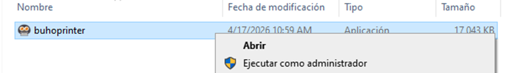

# Buhoprinter Manual

## Impresión rápida y directa desde el Facturador y Mozo

## ¿Qué es BuhoPrinter?

BuhoPrinter es un pequeño programa que se instala en la computadora donde está conectada tu impresora. Una vez instalado, el sistema puede enviarle órdenes de impresión automáticamente, sin que tengas que hacer clic en "imprimir" ni elegir la impresora cada vez.

Funciona tanto desde el **Facturador** (para boletas y facturas) como desde **Mozo** (para comandas y pre-cuentas).

## Lo que necesitas antes de empezar

- La computadora con la impresora encendida y conectada
- El programa BuhoPrinter instalado en esa computadora
- Acceso al panel de configuración del sistema (usuario administrador)
- Conexión a internet

---

## Instalación BuhoPrinter en la computadora de la impresora

### 1. Descargar el ejecutable buhoprinter

Te lo entregará el soporte técnico. Se recomienda desactivar antivirus en caso de que el dispositivo donde se va a instalar buhoprinter no le dé acceso o no permita la descarga.

### 2. Hacer doble clic o anticlick y ejecutar

La instalación procederá y tomará segundos.

### 3. Verificar que se haya instalado correctamente en el sistema

Dirigirse a la barra de tareas y buscar el ícono que está marcado en el recuadro rojo. Una vez ya visualizado el ícono tendremos buhoprint instalado para su uso.

BuhoPrinter se inicia solo cuando enciendes la computadora. No necesitas abrirlo manualmente.

---

## Configurar las impresoras en el sistema

Haz esto desde el panel de administración, en la misma red donde está BuhoPrinter.

### 1. Ingresar al sistema y configurarlo

Una vez logueados nos vamos a Dashboard y buscamos la opción **CONFIGURACION Y MAS** en el apartado de **CONFIGURACIONES GLOBALES**. La opción del recuadro rojo.

### 2. Dirigirse al apartado de Empresa, la opción de AVANZADO

### 3. Dirigirse a la sección de POS y activar IMPRESIÓN DE PDF AUTOMATICA

La casilla debe estar sombreada, así como se muestra en la imagen del recuadro rojo.

### 4. Dirigirse al módulo de RESTAURANTE en la sección de Config. Mesas/Cocina

La sección para ingresar está sombreada.

### 5. Nos dirigimos al Apartado de IMPRESIÓN

Por defecto, como es la primera vez que haces esta configuración, el navegador nos notificará una ventana de acceso. Aceptar el acceso y haz clic en el botón **"Verificar y actualizar"**.

### 6. Activamos la opción de buhoprinter

Solo hacemos click y movemos al estado de ACTIVO. De igual forma, el sistema nos notifica cuando está activo.

### 7. Asigna cada impresora a su propósito

Se nos mostrará 3 columnas y un listado de todas las impresoras que tenemos disponibles. Seleccionar la impresora que se usará.

| Tipo                      | Propósito                                  |
| ------------------------- | ------------------------------------------ |
| **Impresora - Comanda**   | Las comandas que se envían a cocina        |
| **Impresora - Documents** | Boletas, facturas y comprobantes           |
| **Impresora - Precuenta** | La pre-cuenta que se le entrega al cliente |

### 8. Guardar la configuración

¡Listo! A partir de este momento el sistema imprimirá automáticamente en las impresoras que configuraste.

---

## Usar la impresión automática

### 1. Desde el Facturador (boletas y facturas)

Al terminar un pago o generar un comprobante, el sistema envía la impresión automáticamente. No necesitas hacer nada extra.

Si quieres imprimir un documento ya generado, busca el botón de impresión en la vista del documento. El sistema lo enviará directo a la impresora configurada para documentos.

### 2. Desde Mozo (comandas y pre-cuentas)

Al confirmar un pedido, la comanda se envía automáticamente a la impresora de cocina.

Al cerrar una mesa o pedir la pre-cuenta, se imprime en la impresora asignada para ese propósito.

### 3. Opción: Impresión local (solo para la misma red)

Si activas la opción "Impresión local", el sistema solo aceptará órdenes de impresión desde computadoras que estén en la misma red que BuhoPrinter.

Esto es útil si quieres evitar que alguien imprima desde fuera del local.

> Si un usuario intenta imprimir desde una red diferente, verá el mensaje:
> "Impresión local activa: esta terminal no está en la red del servicio de impresión."

---

## Qué hacer si algo no funciona

### La verificación falla o dice "sin conexión"

1. Verifica que la computadora con la impresora esté encendida
2. Verifica que BuhoPrinter esté corriendo (busca el ícono en la barra de tareas)
3. Asegúrate de estar en la misma red que la computadora con la impresora
4. Vuelve a hacer clic en "Verificar y actualizar"

### Las impresoras no aparecen en la lista

1. Haz clic en "Verificar y actualizar" estando en la misma red que la impresora
2. Verifica que la impresora esté encendida y reconocida en Windows (Panel de control → Dispositivos e impresoras)

### La impresión no llega a la impresora

1. Verifica que la impresora esté encendida y con papel
2. Verifica que en la configuración esté asignada la impresora correcta para ese tipo de documento
3. Si el sistema muestra "No hay impresoras configuradas", repite la Parte 2

### Cambié la impresora o la conecté a otra PC

Repite la Parte 1 en la nueva computadora y luego vuelve a hacer "Verificar y actualizar" desde el panel de configuración para que el sistema reconozca las impresoras nuevas.

---

## Reinstalación limpia de BuhoPrinter

Sigue estos pasos cuando BuhoPrinter dejó de funcionar, quedó con errores después de una actualización, o cuando los pasos de la Parte 4 no solucionaron el problema. Este procedimiento borra por completo BuhoPrinter de la computadora (incluyendo archivos de configuración ocultos) y lo deja listo para una instalación desde cero.

### 1. Desinstalar BuhoPrinter desde Windows

- Presiona las teclas **Windows + I** al mismo tiempo para abrir la ventana de Configuración de Windows
- Entra a **Aplicaciones → Aplicaciones instaladas** (en Windows 10 aparece como Aplicaciones y características)
- En la barra de búsqueda que aparece arriba, escribe `buhoprinter`
- Haz clic sobre el resultado, selecciona **Desinstalar** y confirma cuando Windows te pregunte si estás seguro

### 2. Borrar la carpeta de AppData Local

- Presiona las teclas **Windows + R** al mismo tiempo. Se abrirá una ventana pequeña llamada Ejecutar en la esquina inferior izquierda de la pantalla
- Escribe exactamente `%localappdata%` (con los dos signos de porcentaje, sin espacios) y presiona Enter
- Se abrirá una carpeta oculta del sistema ubicada en `C:\Users\TuUsuario\AppData\Local`
- Dentro de esa carpeta, busca la subcarpeta llamada `buhoprinter` (también puede aparecer como `BuhoPrinter`)
- Haz clic derecho sobre la carpeta y selecciona **Eliminar**. Debe desaparecer por completo, con todo lo que tiene dentro

> Si Windows no te deja eliminarla porque dice que "el archivo está en uso", abre el Administrador de tareas (Ctrl + Shift + Esc), busca cualquier proceso que diga buhoprinter y dale **Finalizar tarea**. Después vuelve a intentar eliminar la carpeta.

### 3. Borrar la carpeta de AppData Roaming

- Vuelve a presionar las teclas **Windows + R** para abrir otra vez la ventana Ejecutar
- Esta vez escribe exactamente `%appdata%` (ojo: esta vez sin la palabra local) y presiona Enter
- Se abrirá una carpeta distinta ubicada en `C:\Users\TuUsuario\AppData\Roaming`
- Busca de nuevo la subcarpeta `buhoprinter`, haz clic derecho y selecciona **Eliminar**. Con esto queda limpia también la configuración del usuario

### 4. Vaciar la Papelera de reciclaje

- En el escritorio, haz clic derecho sobre el ícono de la Papelera de reciclaje y selecciona **Vaciar Papelera de reciclaje**
- Este paso garantiza que no queden archivos residuales que puedan interferir con la nueva instalación

### 5. Reiniciar la computadora

Reinicia la PC antes de instalar de nuevo. No te saltes este paso: es necesario para que Windows libere cualquier archivo temporal de BuhoPrinter que haya quedado cargado en memoria.

### 6. Volver a instalar BuhoPrinter y probar

- Sigue nuevamente los pasos de la **PARTE 1 - Instalación BuhoPrinter** de este manual para instalarlo desde cero
- Después entra al sistema, vuelve a hacer clic en "Verificar y actualizar" (como se indica en la **PARTE 2**) y realiza una impresión de prueba para confirmar que todo quedó funcionando correctamente

---

## Soporte técnico

Para soporte técnico contactar a: **buho@buho.cloud**
