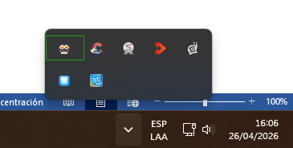
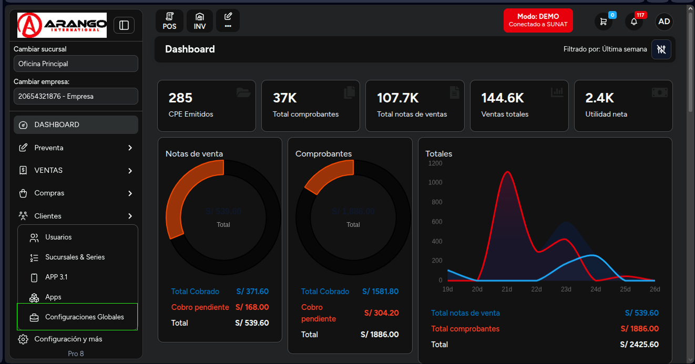
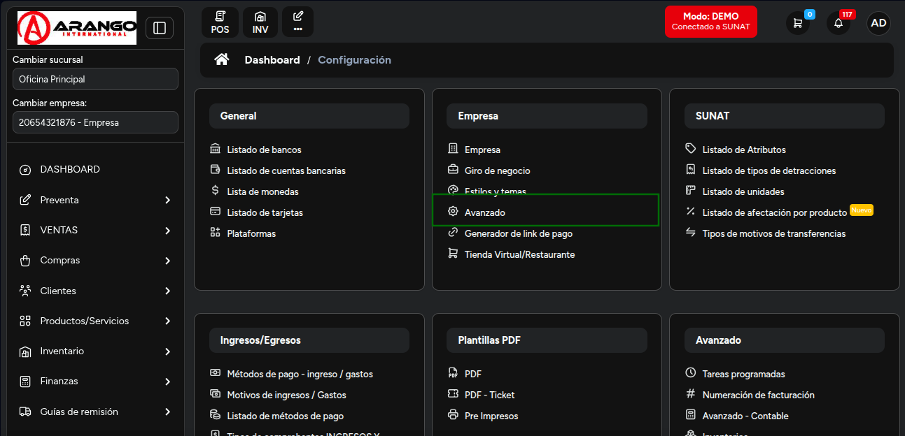
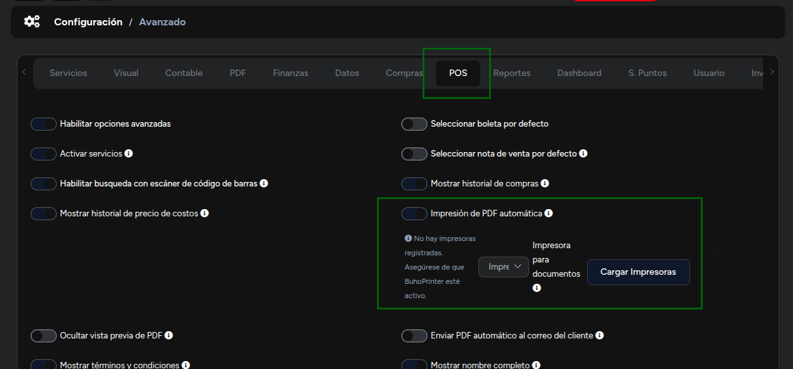
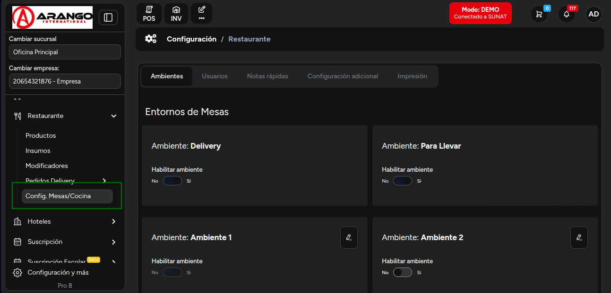
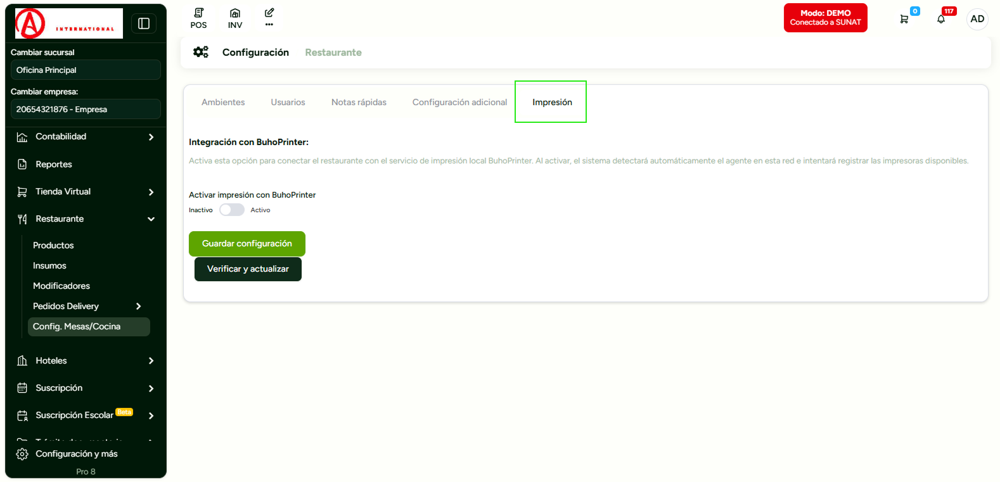
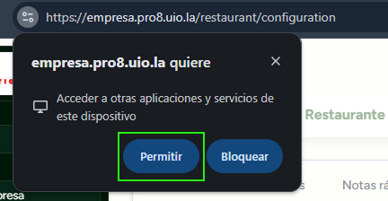
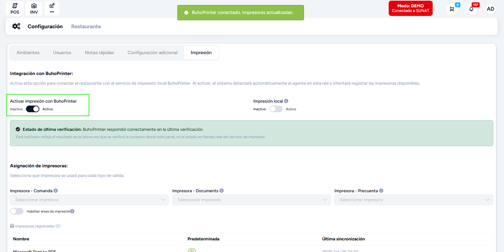
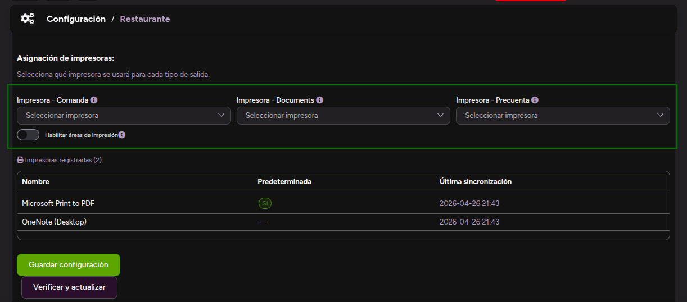

# Buhoprinter Manual

## Impresión rápida y directa desde el Facturador y Mozo

## ¿Qué es BuhoPrinter?

BuhoPrinter es un pequeño programa que se instala en la computadora donde está conectada tu impresora. Una vez instalado, el sistema puede enviarle órdenes de impresión automáticamente, sin que tengas que hacer clic en "imprimir" ni elegir la impresora cada vez.

Funciona tanto desde el **Facturador** (para boletas y facturas) como desde **Mozo** (para comandas y pre-cuentas).

## Lo que necesitas antes de empezar

- La computadora con la impresora encendida y conectada
- El programa BuhoPrinter instalado en esa computadora
- Acceso al panel de configuración del sistema (usuario administrador)
- Conexión a internet

---

## Instalación BuhoPrinter en la computadora de la impresora

### 1. Descargar el ejecutable buhoprinter

Descarga el ejecutable desde el siguiente enlace:

  <a href="/instaladores-buho-printer/buhoprinter.exe" download="buhoprinter.exe">Descargar BuhoPrinter Windows</a>

  <a href="/instaladores-buho-printer/BuhoPrinter.dmg" download="BuhoPrinter.dmg">Descargar BuhoPrinter MacOS</a>

---

Se recomienda desactivar antivirus en caso de que el dispositivo donde se va a instalar buhoprinter no le dé acceso o no permita la descarga.

### 2. Hacer doble clic o anticlick y ejecutar

La instalación procederá y tomará segundos.

### 3. Verificar que se haya instalado correctamente en el sistema

Dirigirse a la barra de tareas y buscar el ícono que está marcado en el recuadro rojo. Una vez ya visualizado el ícono tendremos buhoprint instalado para su uso.

BuhoPrinter se inicia solo cuando enciendes la computadora. No necesitas abrirlo manualmente.

---

## Configurar las impresoras en el sistema

Haz esto desde el panel de administración, en la misma red donde está BuhoPrinter.

### 1. Ingresar al sistema y configurarlo

Una vez logueados nos vamos a Dashboard y buscamos la opción **Configuraciones y más** en el apartado de **Configuraciones globales**.

### 2. Dirigirse al apartado de Empresa, la opción de AVANZADO

### 3. Dirigirse a la sección de POS y activar IMPRESIÓN DE PDF AUTOMATICA

La casilla debe estar sombreada, es decir el toggle debe estar en la derecha.

### 4. Dirigirse al módulo de Restaurante en la sección de Configuración

### 5. Nos dirigimos al Apartado de Impresión

Por defecto, como es la primera vez que haces esta configuración, el navegador nos notificará una ventana de acceso.

Aceptar el acceso y haz clic en el botón **"Verificar y actualizar"**.

### 6. Activamos la opción de buhoprinter

Solo hacemos click y movemos al estado de ACTIVO. De igual forma, el sistema nos notifica cuando está activo.

### 7. Asigna cada impresora a su propósito

Se nos mostrará 3 columnas y un listado de todas las impresoras que tenemos disponibles. Seleccionar la impresora que se usará.

| Tipo                      | Propósito                                  |
| ------------------------- | ------------------------------------------ |
| **Impresora - Comanda**   | Las comandas que se envían a cocina        |
| **Impresora - Documents** | Boletas, facturas y comprobantes           |
| **Impresora - Precuenta** | La pre-cuenta que se le entrega al cliente |

### 8. Guardar la configuración

¡Listo! A partir de este momento el sistema imprimirá automáticamente en las impresoras que configuraste.

---

## Usar la impresión automática

### 1. Desde el Facturador (boletas y facturas)

Al terminar un pago o generar un comprobante, el sistema envía la impresión automáticamente. No necesitas hacer nada extra.

Si quieres imprimir un documento ya generado, busca el botón de impresión en la vista del documento. El sistema lo enviará directo a la impresora configurada para documentos.

### 2. Desde Mozo (comandas y pre-cuentas)

Al confirmar un pedido, la comanda se envía automáticamente a la impresora de cocina.

Al cerrar una mesa o pedir la pre-cuenta, se imprime en la impresora asignada para ese propósito.

### 3. Opción: Impresión local (solo para la misma red)

Si activas la opción "Impresión local", el sistema solo aceptará órdenes de impresión desde computadoras que estén en la misma red que BuhoPrinter.

Esto es útil si quieres evitar que alguien imprima desde fuera del local.

> Si un usuario intenta imprimir desde una red diferente, verá el mensaje:
> "Impresión local activa: esta terminal no está en la red del servicio de impresión."

