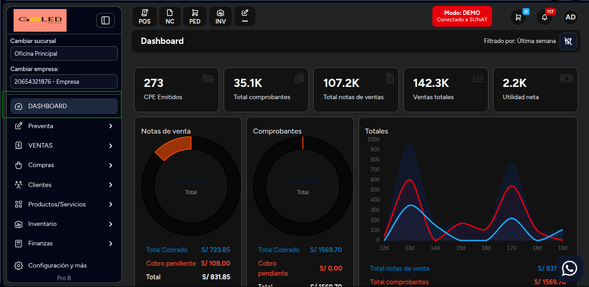
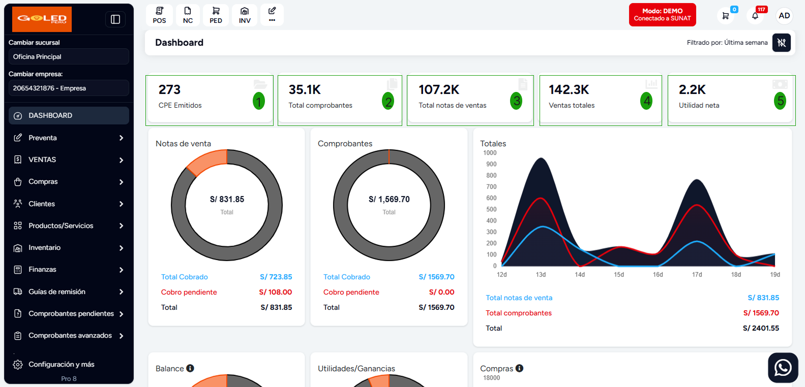
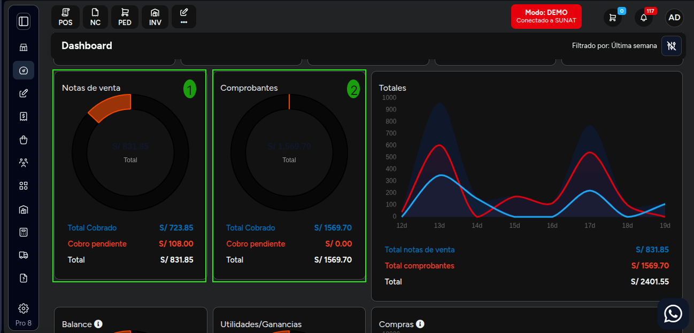
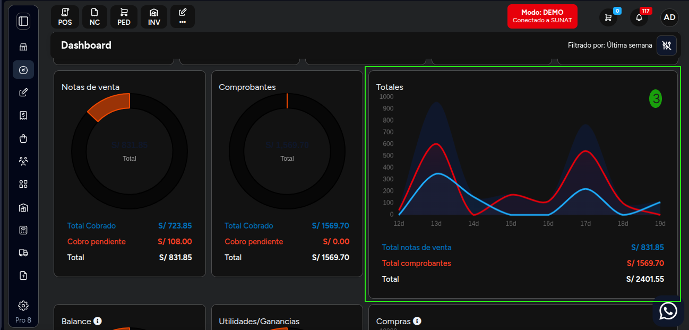
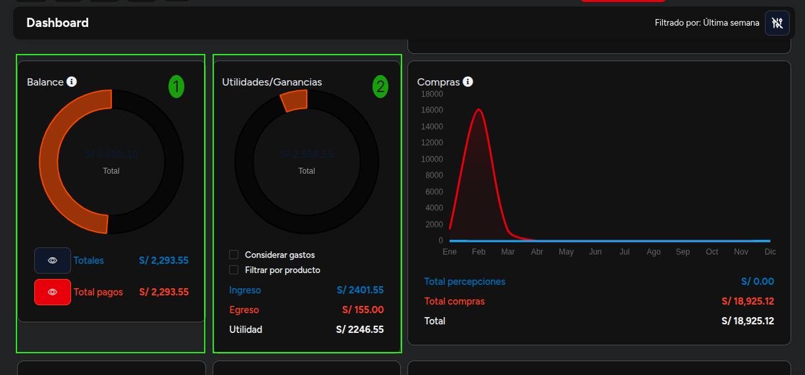
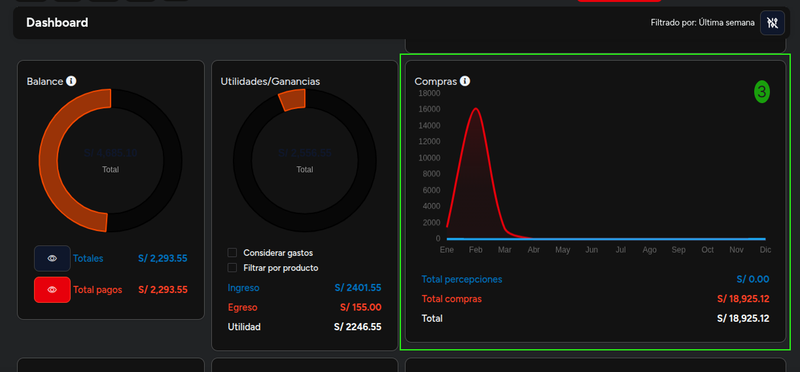
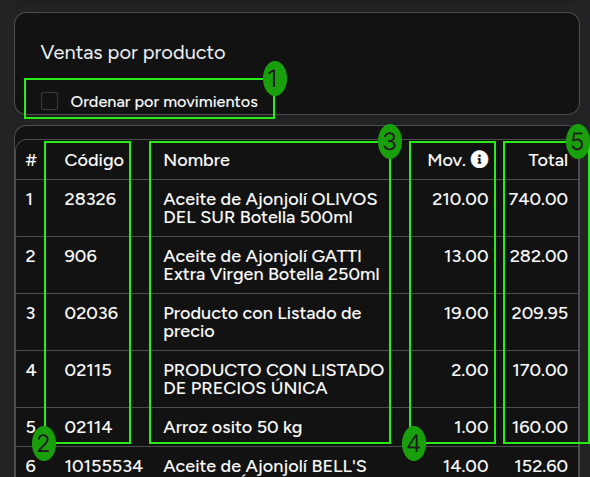
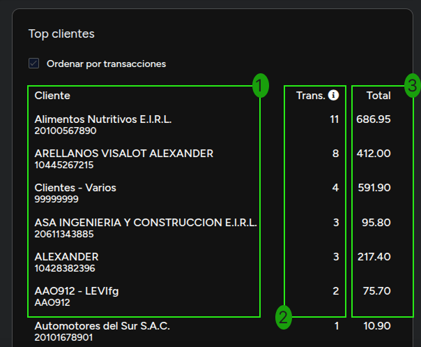
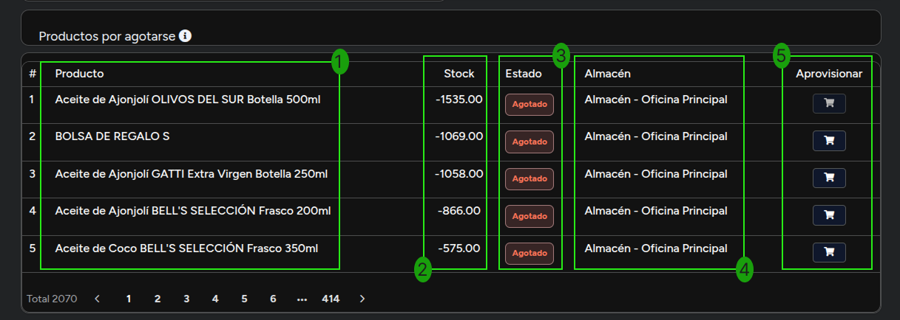

# Dashboard

El **Dashboard** es la interfaz principal que proporciona una visión general del rendimiento y la actividad de tu negocio. A continuación, se describen las diferentes secciones y métricas que puedes encontrar en el Dashboard.

---

## Métricas y Ventas

### 1. Resumen General

Esta sección proporciona datos generales sobre tu empresa:

1. **CPE Emitidos**: Número total de Comprobantes de Pago Electrónicos (CPE) emitidos.
2. **Total comprobantes**: Cantidad total de comprobantes generados.
3. **Total Notas de Venta**: Cantidad total de notas de venta generadas.
4. **Ventas totales**: Total monetario de ventas en el periodo seleccionado.
5. **Utilidad neta**: Monto total de la utilidad obtenida.

---

### 2. Notas de Venta y Comprobantes

En esta sección se visualizan los totales de:

1. Notas de Venta
2. Comprobantes Emitidos

- **Total Cobrado**: Monto total que ha sido cobrado a través de notas de venta.
- **Cobros Pendientes**: Monto que aún está pendiente de recibir.
- **Total**: Monto total del **Total Cobrado** y **Cobros Pendientes**.

3. Totales

Gráfico de la suma de totales de notas de venta y comprobantes emitidos.

---

## Finanzas y Compras

### 1. Balance

La sección de **Balance** proporciona información relevante sobre el estado financiero:

- **Totales**: Total de ingresos y pagos realizados.
- **Total pagos**: Monto total de pagos procesados.

---

### 2. Utilidades/Ganancias

Muestra un resumen de las utilidades obtenidas del negocio:

- **Ingreso**: Total de ingresos generados.
- **Egreso**: Total de gastos realizados.
- **Utilidad**: Monto neto de ganancias tras calcular los ingresos y egresos.

---

### 3. Compras

El gráfico de **Compras** muestra los totales de compra a lo largo del tiempo:

- Visualiza las tendencias mensuales de compras.
- **Total de Percepciones**: Total de percepciones emitidas.
- **Total de Compras**: Total de compras realizadas.
- **Total**: Suma de **Total de Percepciones** y **Total de Compras**.

---

## Productos y Clientes

### 1. Ventas por Producto

En la sección de **Ventas por producto**, puedes visualizar:

1. **Ordenar por Movimientos**: Ordena los productos por el número de movimientos.
2. **Código**: Identificación única de cada producto.
3. **Nombre**: Descripción del producto.
4. **Movimientos**: Total de unidades vendidas.
5. **Total**: Total de ingresos generados por cada producto.

---

### 2. Top Clientes

Esta sección muestra a tus principales clientes según el número de transacciones realizadas:

1. **Cliente**: Nombre del cliente.
2. **Trans.**: Número de transacciones realizadas por cada cliente.
3. **Total**: Monto total de las compras realizadas por cada cliente.

---

### 3. Productos por Agotarse

Aquí puedes identificar los productos que están a punto de agotarse:

1. **Producto**: Nombre del producto.
2. **Stock**: Cantidad disponible de cada producto.
3. **Estado**: Indica si el producto está agotado.
4. **Almacén**: Ubicación del producto en el inventario.
5. **Aprovisionar**: Botón para aprovisionar el producto; al hacer clic serás redirigido a la pestaña de **Compras**.