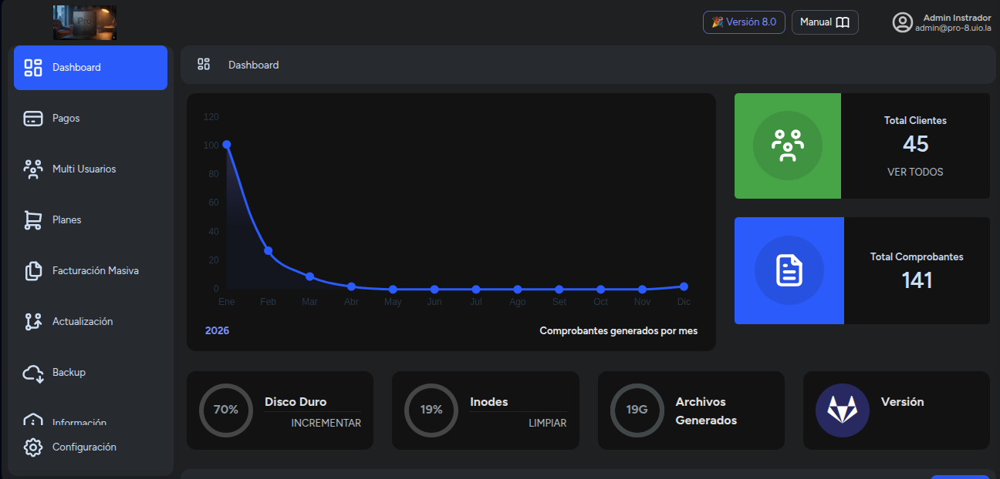
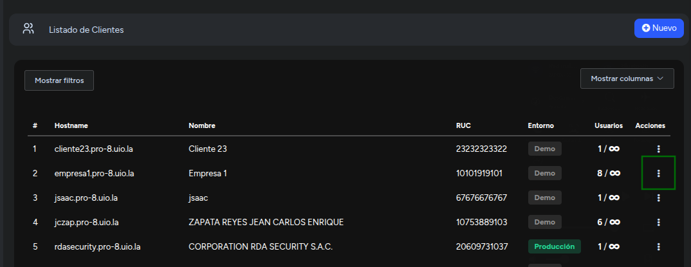
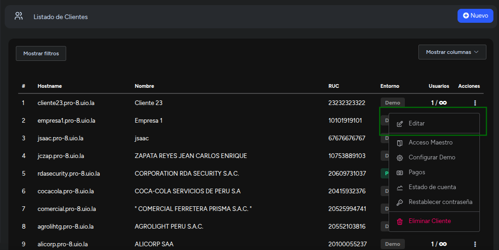
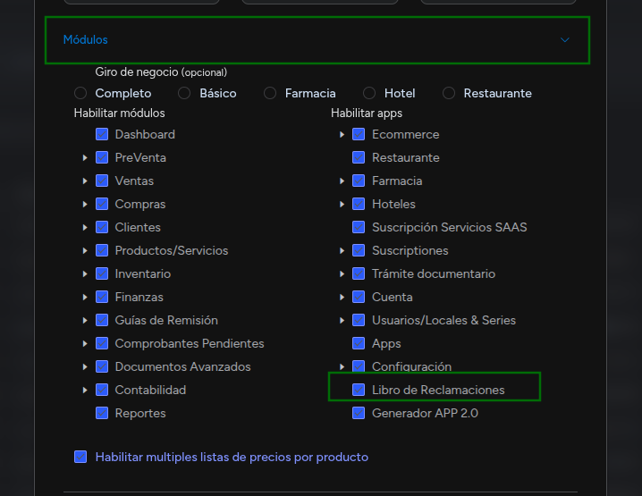
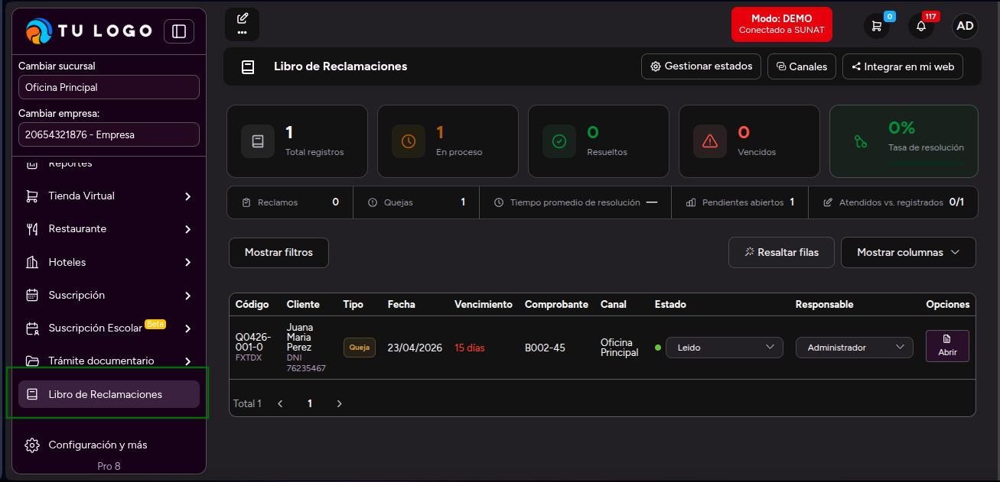

# Cómo habilitar el Libro de Reclamaciones

Esta guía explica los pasos necesarios para activar el módulo de **Libro de Reclamaciones** en el sistema.

> **Requisito previo:** El sistema debe estar actualizado antes de continuar. Consulta el [manual de actualización](../../devs/despliegue/mantenimiento/actualizar-migrar.md) o contacta a soporte para solicitarla.

---

## 1. Activar el módulo

### Paso 1 — Ingresar al panel de Administrador

Accede con una cuenta de administrador del sistema central.

### Paso 2 — Ir al Listado de Clientes

En el menú principal, dirígete a **Listado de Clientes**. Ubica el cliente al que deseas habilitar el módulo y haz clic en el ícono de tres puntos (⋮) en la columna **Acciones**.

### Paso 3 — Seleccionar "Editar"

Del menú desplegable, selecciona la opción **Editar**.

### Paso 4 — Marcar el módulo

Dentro del formulario de edición, despliega la sección **Módulos** y marca la casilla **Libro de Reclamaciones**.

### Paso 5 — Guardar los cambios

Haz clic en **Guardar** para aplicar la configuración.

---

## 2. Verificar la activación

El usuario final debe recargar su sistema presionando **F5**. Si el módulo se habilitó correctamente, aparecerá la opción **Libro de Reclamaciones** en la parte inferior del menú lateral (sidebar).

:::danger
Esta configuración se realiza desde el sistema central del administrador, no desde el panel del cliente.
:::